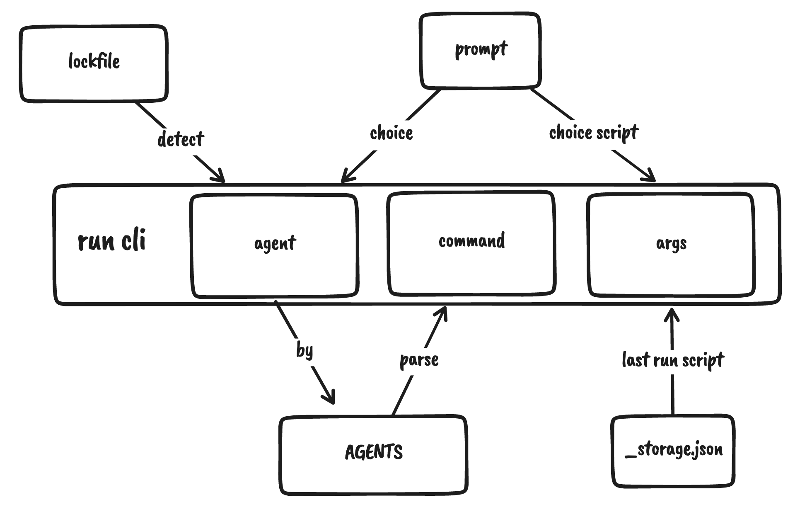

# pi

[venv](https://docs.python.org/3/library/venv.html) · [pipenv](https://pipenv.pypa.io/en/latest/) · [poetry](https://python-poetry.org/) · [conda](https://docs.conda.io/en/latest/)

<pre align="center">
🧪 Working in Progress
</pre>

```bash
npm i -g @zhengbangbo/pi
```



## pi - install

```bash
pi

# python -m venv .venv && source .venv/bin/activate && pip install -r requirements.txt
# pipenv install
# poetry install

pi rich

# pip install rich
# pipenv install rich
# poetry add rich
```

## pru - run

```bash
pru dev

# pipenv run dev
# poetry run dev
```

## psh - enter virtual environment

```bash
psh

# pipenv shell
# pipenv shell
```

## pun - uninstall

```bash
pun

# pipenv uninsatll
# poetry remove
```

## pu - update

```bash
pu

# pipenv update
# poetry update
```

## pci - clean install

```bash
pci

# pipenv clean
```

## pa - agent alias

```bash
pa

# pipenv
# poetry
```

## How?

**pi** assumes that you work with lockfiles (and you should)

Before it runs, it will detect your `requirement.txt` / `Pipfile.lock` / `poetry.lock` to know current package manager and runs the corresponding commands.

## Todo

- [ ] detect agent
  - [ ] venv
  - [x] pipenv
  - [x] poetry
  - [ ] conda
- [ ] cover main commands
- [ ] install pipenv / poetry / conda script

## Credit

This project is inspired by Anthony Fu's [antfu/ni](https://github.com/antfu/ni) project and has many references.

## License

[MIT](./) License © 2022 [Bang-Bo Zheng](https://github.com/zhengbangbo)
